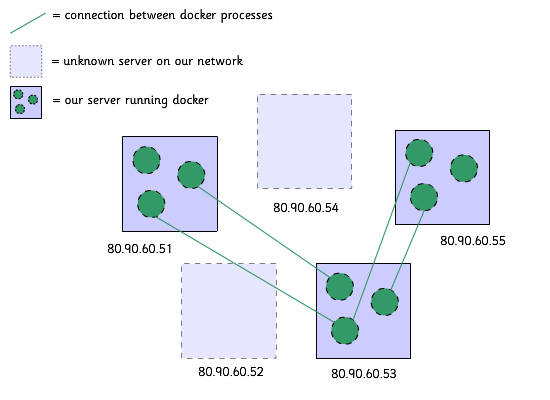

vpc
===

Virtual Private Cluster - configure an iptables whitelist for a private network of docker hosts.



## Why?

Beacuse I wanted my own little network of machines inside Digital Ocean all communicating over the private network.

I didn't want other droplets to be able to connect to the services on my droplets.

I did want to still talk to docker containers from my other droplets.

vpc is an api to do this - it is based on [iptables-boilerplate](https://github.com/bmaeser/iptables-boilerplate) with an api to manage hosts and ports and with modifications to play nice with docker.

## installation

```
$ wget -qO- https://raw.github.com/binocarlos/vpc/master/bootstrap.sh | sudo bash
```

## usage

vpc allows easy whitelisting of ip addresses and ports.

The default is for everything is be disallowed apart from ports:

 * 22
 * 80
 * 443

### vpc add-host <ip>

Add a new host to the whitelist:

```bash
$ sudo vpc add-host 10.12.13.14
```

### vpc remove-host <ip>

Remove a host from the whitelist:

```bash
$ sudo vpc remove-host 10.12.13.14
```

### vpc hosts

List the hosts in the whitelist:

```bash
$ sudo vpc hosts
```

### vpc add-port <port>

Add a port to the whitelist:

```bash
$ sudo vpc add-port 443
```

### vpc remove-port <port>

Remove a port from the whitelist:

```bash
$ sudo vpc remove-port 443
```

### vpc ports

List the ports in the whitelist:

```bash
$ sudo vpc ports
```

### vpc ls

List the items in the whitelist:

```bash
$ sudo vpc ls
```

### vpc status

Show the current status of the firewall:

```bash
$ sudo vpc status
```

### vpc apply

Apply the firewall:

```bash
$ sudo vpc apply
```

### vpc cancel

Cancel the firewall:

```bash
$ sudo vpc cancel
```

### vpc reset

Reset the firewall (warning - deletes data):

```bash
$ sudo vpc reset
```

### vpc start

start the firewall

```bash
$ sudo vpc start
```

### vpc stop

stop the firewall

```bash
$ sudo vpc stop
```

## license

MIT